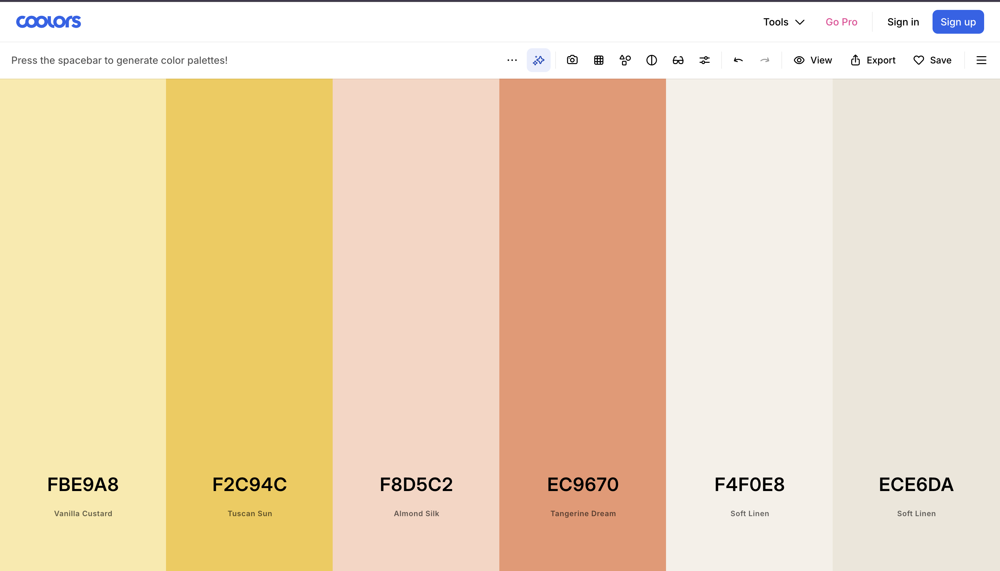

# UI Design Process — Prototyping & Iteration

## Introduction

This document outlines the end-to-end UI design and prototyping process undertaken for this project, from initial concept sketches through to a polished high-fidelity prototype. The process followed an iterative, user-centered approach: starting with low-fidelity wireframes to quickly explore layout ideas and interaction patterns, then progressively refining the design through feedback and structured iteration before arriving at the final prototype. Throughout, design decisions were grounded in the project requirements specification (PRS) and guided by core HCI principles such as clarity, consistency, and discoverability.

A key part of this workflow involved leveraging **Claude Design** as a prototyping accelerator during the high-fidelity phase. The tool was used deliberately and directionally, with human-defined structure, content, and aesthetics informing every generated output.

---

## 1. Low-Fidelity Wireframes: Initial Exploration

*Figure 1 — Early-stage low-fidelity wireframes covering the six initial screens.*

The wireframing phase began immediately after a thorough reading of the project requirements specification. The goal at this stage was not visual polish, but **speed of ideation**. We quickly sketched out possible screen structures and navigation flows without getting distracted by color, typography, or fine detail.

Six screens were scoped and wireframed in this initial pass:

- **Map** — The core discovery screen. Shows nearby users as dot markers on a canvas, with an "adjust radius" control at the bottom and an anonymous mode toggle in the top corner. Dots represent other users within the selected proximity radius; users interact by tapping a dot to learn more about that person.
- **Chat** — A messaging inbox with a search bar at the top and a scrollable list of conversation entries, each marked with a circular avatar. A "plus" button in the top right allows users to initiate new conversations.
- **Profile** — Displays a user's avatar, display name, bio, interests, and linked accounts (e.g. Instagram, Discord) in a single-column scrollable layout. Users can view and manage their identity and social connections from this screen.
- **Video** — A grid of six video thumbnails under a "see what's going on nearby" heading. Users browse short-form content posted by people in their area by tapping any thumbnail to play.
- **Landing Page** — The onboarding and registration screen, with a short tagline ("let's get you on the map") and input fields for display name, email, and password, followed by a "continue" button to progress through setup.
- **Interests** — An onboarding screen where users pick interest categories. Tags are grouped by topic and rendered as pill-shaped chips; tapping a chip selects it. This data drives the map's filtering and matching logic.

---

## 2. Low-Fidelity Wireframes: Refined Layouts

*Figure 2 — Completed and refined low-fidelity wireframes across all major activity views.*

Following the initial exploration, the wireframes were iterated upon based on a critical review of each screen's usability and alignment with the PRS. The scope expanded significantly in this pass: from 6 screens to 13, covering secondary flows and overlay states that were absent from the first draft.

New and revised screens in this iteration:

- **Pull Up Menu** — A bottom sheet modal accessible from the Map screen. Displays the anonymous mode toggle, an "adjust radius" slider, and a grid of nearby people filterable by shared interests. Interest tags at the top of the sheet act as filter chips; tapping one narrows the grid to people who share that interest. Users tap a person's card to open their Information Popup.
- **Information Popup** — A compact overlay showing a tapped user's name, bio, and interest tags (main interest + subinterests). Gives users a quick preview before deciding to message or engage further.
- **Chat (Individual)** — The one-on-one messaging view, with a back arrow, chat name, and settings link in the header. Messages are displayed in a standard bubble layout; a text input with a send button sits at the bottom.
- **Chat Settings** — Accessible from the individual chat header. Shows the group chat name, a list of members with avatars, and export options to external platforms (Instagram, Discord).
- **Add Interests / Edit & Add Interests** — Expands the onboarding interest picker into a full post-onboarding management screen. Users can add, remove, or edit existing interests at any time from their profile.
- **Add Subinterest** — A drill-down screen triggered by tapping an interest's "+ specifics" affordance. Shows existing/suggested subinterest tags and a free-text field to add custom ones (e.g. `#singles`, `#4-player`, `#beginner`).
- **Record** — The video recording screen, accessed via the Video tab. Shows current GPS coordinates (longitude, latitude) and a large circular record button. A "done" button ends recording and advances to the Post screen.
- **Post** — The post-recording screen where users add a caption, select a visibility setting (public / nearby / friends), and either cancel or post. The video is attached and will appear on the nearby video feed once posted.

This iteration also introduced **explicit bottom navigation bars** across all screens and added **annotation labels** (e.g. "pull up MENU (see below)") to communicate how screens connect and which interactions trigger which states.

---

## 3. Color Palette Exploration & Selection

*Figure 3 — Palette 1: warm neutral tones including butter yellows, peach, terracotta, and linen.*

*Figure 4 — Palette 2: a five-step green scale from Mint Cream through to Pine Teal.*

Both palettes were composed using [Coolors](https://coolors.co) and selected together to form a cohesive two-palette system.

### Palette Rationale

Color selection was treated as a deliberate design decision rather than an aesthetic preference. The chosen palette was evaluated against three criteria: **usability**, **visual coherence**, and **appropriateness for the application's context and audience**.

**Palette 1 — Warm Neutrals: Butter, Peach & Linen (Backgrounds & Accents)**

| Name | Hex | Role |
|---|---|---|
| Vanilla Custard | `#FBE9A8` | Warm background tint; used on the landing screen |
| Tuscan Sun | `#F2C94C` | Attention-drawing accent; badges and highlights |
| Almond Silk | `#F8D5C2` | Light peach for card surfaces and soft UI regions |
| Tangerine Dream | `#EC9670` | Terracotta for accent chips, tags, and secondary interactive states |
| Soft Linen | `#F4F0E8` | Primary background across most screens |
| Soft Linen (deep) | `#ECE6DA` | Slightly deeper surface for cards and content containers |

The linen and butter tones serve as the dominant background and surface colors, giving the app a warm, paper-like quality that avoids the sterility of pure white. Peach and terracotta (`#F8D5C2`, `#EC9670`) are used for interest and subinterest tags, adding warmth and personality without overwhelming the green primary. Tuscan Sun appears sparingly for callout badges.

**Palette 2 — Greens: Mint to Pine (Primary Brand Colors)**

| Name | Hex | Role |
|---|---|---|
| Mint Cream | `#ECF5EE` | Near-white tint for section backgrounds |
| Honeydew | `#D7EAD8` | Soft sage for low-emphasis backgrounds and hover states |
| Seaweed | `#4CA582` | Mid-weight green for secondary buttons and interactive tags |
| Dark Emerald | `#0B6E4F` | Primary action color; main CTA buttons, selected nav states |
| Pine Teal | `#064A35` | Near-black green for the navigation bar, headings, and high-contrast text |

The deep greens anchor the interface as the dominant brand and action color. Dark Emerald and Pine Teal are used for primary buttons, the bottom navigation bar, and key headings. Lighter tints (Mint Cream, Honeydew) appear in card backgrounds and section regions where a subtle green presence reinforces the brand without competing with content.

### Usability & Accessibility Considerations

All foreground/background color pairings were checked to ensure they meet **WCAG AA contrast ratio standards** (minimum 4.5:1 for body text, 3:1 for large text and UI components). The deep greens against linen backgrounds and white text against Dark Emerald buttons both satisfy these requirements.

---

## 4. High-Fidelity Prototype

*Figure 5 — Final high-fidelity prototype generated using Claude Design, showing all major screens at production fidelity.*

The high-fidelity prototype represents the culmination of all prior design work. It translates the structural decisions of the wireframes and the visual language of the two color palettes into a realistic, detailed representation of the application's UI.

### Screens in the Prototype

The HiFi prototype covers the following screens, all of which map directly to wireframes produced in earlier iterations:

- **Landing / Splash** — "who's around right now?" hero screen on a warm linen background with green "Create an account" CTA and a secondary "I already have one" link.
- **Sign Up** — "let's get you on the map" registration form with display name, email, and password fields and a prominent green "Continue" button.
- **Add Interests (Onboarding)** — Interest picker with pill-chip tags grouped by category (Sports, Arts, Outdoors, Food, Social). Selected chips are highlighted in terracotta/peach; unselected ones appear in a light neutral. A "See the map" CTA becomes available once the minimum selections are met.
- **Add Subinterest** — Drill-down panel for adding specifics to a selected interest (e.g. Pickleball → `#singles`, `#4-player`, `#beginner`). Suggested subinterests and a free-text input field allow both guided and custom entry.
- **Map** — The core screen. An illustrated map with colored pins and dot markers for nearby users, a radius indicator, nearby-count summary bar, and a "pull up" handle for the bottom sheet. Anonymous mode toggle appears in the top-left.
- **Video Feed (Nearby)** — Full-screen vertical video player with a blurred ambient background and a record button, surfacing content posted by nearby users. Tabs switch between "Nearby" and "Following" feeds.
- **Chat List** — Inbox of recent conversations with avatar chips, name, last message preview, and timestamp. A "+" button opens a new chat; a search bar sits at the top.
- **Chat (Individual)** — Conversation thread with bubble-style messages, a text input, and a send button. The header shows the group name, member count, and a settings icon.
- **Chat Settings** — Group details panel showing member avatars, names, and export options to Instagram and Discord.
- **Profile** — User profile with avatar, bio, interest chips (with subinterest tags inline), linked accounts section, and edit controls. The Pine Teal navigation bar anchors the screen at the bottom.
- **Edit Profile** — Editable version of the profile screen with form fields for display name, bio, and interest management; a "Save" button commits changes.
- **Edit/Add Interests** — Full interest management screen with add, remove, and specifics controls across all interest categories.
- **Record** — Camera recording screen with a large circular red record button and location display.
- **Post** — Caption entry screen with visibility selector (public / nearby / friends) and post/cancel actions.
- **Posted Confirmation** — "posted to the map." success screen with a checkmark, description, and quick-navigation CTAs.

### UI Elements and Interaction Model

| Element | Role | Expected Interaction |
|---|---|---|
| Bottom navigation bar (Pine Teal) | Global navigation across Map, Video, Chat, and Profile tabs | Tap to switch between top-level views |
| Map pins & dot markers | Represent nearby users on the map | Tap to open the Information Popup for that user |
| Interest / subinterest chips | Display and filter by shared interests | Tap to select/deselect; used both on profiles and as filter chips in the Pull Up Menu |
| Pull Up Menu (bottom sheet) | Filters nearby users by interest and adjusts radius | Swipe up from the map handle; tap interest chips to filter the people grid |
| "+" button (Chat) | Initiates a new conversation | Single tap opens a new chat composer |
| Record button | Begins video capture | Tap to start recording; tap again or hit done to stop |
| Visibility selector (Post screen) | Controls who can see a posted video | Tap to toggle between public, nearby, and friends |
| Primary CTA buttons (Dark Emerald) | Advance through flows or commit actions | Single tap to confirm, submit, or navigate forward |
| Anonymous mode toggle | Hides the user's position on the map | Tap to enable/disable; persists across sessions |

---

## 5. Role of Claude Design in the Prototyping Process

Claude Design was introduced at the high-fidelity stage to accelerate the translation from refined wireframes to a polished visual prototype. Rather than replacing the design process, it functioned as a **generative tool operating under human direction** — the quality and accuracy of its output depended directly on the quality of the inputs provided to it.

### Inputs Provided to Claude Design

Three artefacts were supplied as context:

1. **The project requirements specification** — to ground the generated prototype in the actual functional and non-functional requirements of the system.
2. **The completed LoFi wireframes** — to communicate screen structure, layout, content regions, and interaction patterns established through iteration.
3. **The selected color palettes** — to ensure the generated prototype applied the correct visual language (Pine Teal navigation bars, linen backgrounds, terracotta interest chips) rather than defaulting to generic styling.

### How It Accelerated Prototyping

- **Reduced mechanical effort:** Translating every wireframe screen into a fully styled mockup manually would require significant time in a tool like Figma. Claude Design compressed this step substantially by generating visually coherent HiFi screens from the provided wireframes.
- **Enabled faster evaluation:** Because the generation step was fast, it was possible to quickly assess whether the wireframe structures translated well visually, and identify screens that needed revision before committing to a final design.
- **Consistent palette application:** Supplying both color palettes as explicit inputs ensured colors were applied coherently across all generated screens — something that is error-prone when styling manually screen by screen.

### Human Direction Was Still Essential

Claude Design did not make design decisions autonomously. The critical choices (what screens to include, how to structure each layout, which interactions to prioritize, which colors served which roles, and what the app's identity and purpose should be) were all made prior to generation. Claude Design's role was execution, not conception. The final prototype reflects those human-directed decisions rendered at high fidelity.

---

## 6. Conclusion

This project followed a disciplined, iterative design process that moved deliberately from rough wireframes through to a polished high-fidelity prototype. Each phase built on the last: wireframing established structure, iteration expanded scope and refined usability, palette selection defined the visual identity, and high-fidelity prototyping brought it all together in a form that closely resembles a finished product.

The use of Claude Design as a prototyping tool demonstrated how AI-assisted design can meaningfully accelerate the later stages of the UI process. We did not replace design thinking, but we reduced the mechanical overhead of moving from a well-specified wireframe to a visually realized screen. The quality of the human design work upstream directly determined the quality of what was generated downstream.

The resulting prototype satisfies all major activity views specified in the requirements, presents a consistent and accessible visual identity built on the two-palette green-and-warm-neutral system, and clearly communicates the intended user interactions.
